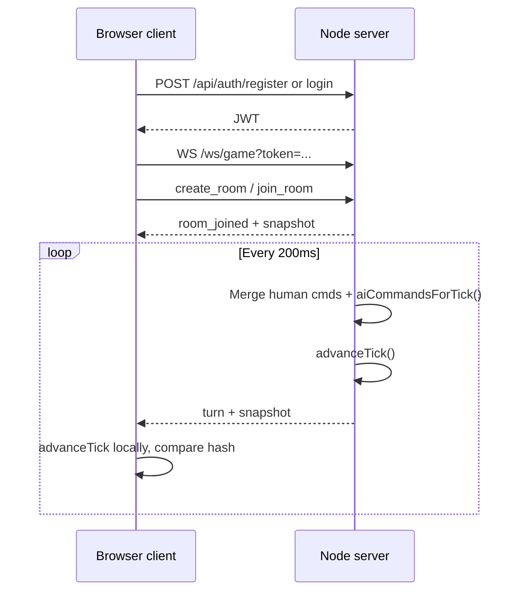

# Client vs server split (networking test harness)

**Status:** implemented in `packages/*` — test harness, not full RTS.

## Decision summary

| Responsibility | Owner | Why |
|----------------|-------|-----|
| Email/password accounts, JWT | **Server** | Secrets and password hashes must not live in the browser |
| WebSocket auth (JWT on connect) | **Server** | Gate who can open a game connection |
| Tick clock (200 ms test rate) | **Server** | One authority for “when is tick N” so AI and humans share the same frame |
| **AI command generation** | **Server** | Guarantees all clients see identical AI moves without running AI locally |
| Human command collection | **Server** | Buffers `submit_command` until tick fires |
| Turn bundle broadcast | **Server** | `{ tick, commands[], stateHash }` + snapshot |
| Deterministic sim advance | **Client + server** | Server runs truth; each client replays the same commands to verify sync |
| Rendering / Pixi (future) | **Client** | Presentation only |
| Full game rules / pathfinding (future) | **Client sim worker** | Lockstep target; must stay deterministic |

This is **validate-and-relay + server-owned AI commands**, not full server simulation of the RTS.

## Test harness flow

## AI sync rule (important)

**Clients must not run AI logic in multiplayer.** They only apply AI commands received in the turn bundle. When the real RTS AI ships in `features/ai/`, multiplayer should either:

1. Keep **server-side AI** and broadcast AI intents (current test pattern), or
2. Move to **deterministic AI** in shared sim with a shared seed (harder; needed for true lockstep without server sim).

For v0 local skirmish, AI can stay client-only. For online play, prefer (1) until core sim is provably deterministic.

## What to try manually

1. `npm install` at repo root
2. Copy `.env.example` → `.env`
3. Terminal A: `npm run dev:server`
4. Terminal B: `npm run dev:client`
5. Two browser windows (or normal + incognito): register/login, connect WS, same room ID, watch **AI Opponent** row move in sync; move with arrow buttons; confirm **in sync** on each tick.

## Next steps toward real multiplayer

- [ ] Replace stub sim with `core-simulation` tick
- [ ] Intent schema from `input-selection`
- [ ] Client-side validation before send; server ownership checks
- [ ] Input delay buffer for latency
- [ ] Reconnect + snapshot resync
