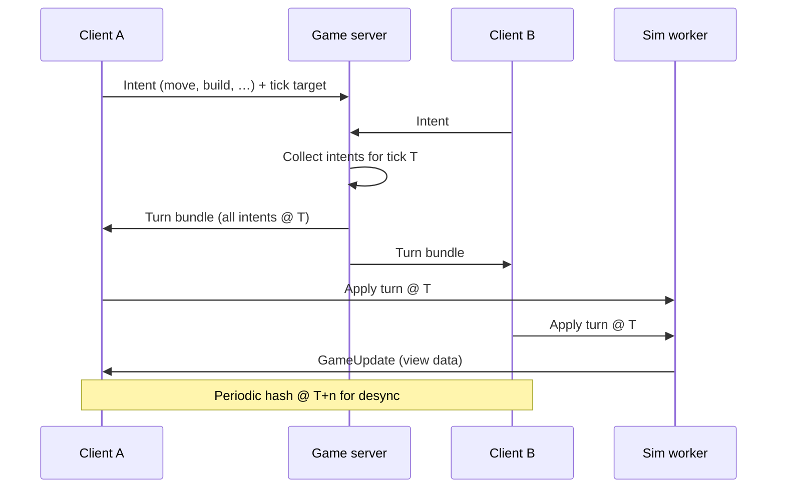

# Research — networking & authentication (post v0)

**Status:** exploratory · **Scope:** informs `multiplayer` and future `persistence` / accounts work  
**v0 constraint:** local skirmish only — no server, no accounts ([prototype-v0.md](../../game-vision/data/prototype-v0.md))

This document summarizes industry patterns for browser RTS multiplayer and identity, with recommendations tailored to RTSBrowser’s planned architecture (deterministic fixed tick, Pixi render split, TypeScript).

---

## 1. Why this matters for RTSBrowser

| v0 (now) | Post v0 |
|----------|---------|
| Single sim in one tab | Multiple humans need synchronized simulation |
| AI on same tick | Commands must arrive and execute on the same tick for all peers |
| “Deterministic-friendly” ([prototype-v0.md](../../game-vision/data/prototype-v0.md)) | Must become **strictly deterministic** for lockstep |
| No auth | Identity needed for lobbies, ratings, cloud saves, moderation |

**Design implication:** v0 choices (fixed tick, sim/renderer split, worker-ready core) align with lockstep RTS — but multiplayer is a **multiplier** on determinism cost, not a separate networking bolt-on.

---

## 2. RTS multiplayer models (comparison)

### 2.1 Deterministic lockstep (classic RTS)

**How it works:** Clients (and optionally a host) run the **same** simulation. The network carries **player commands** (intents), not unit positions. Each tick advances only when every peer’s commands for that tick are known. Optional **input delay** buffers latency.

| Pros | Cons |
|------|------|
| Low bandwidth at high unit counts | Entire sim must be deterministic |
| Proven (AoE, SC, C&C, many browser clones) | Worst-player latency sets pace; stalls if one peer lags |
| Natural fit for replay / spectate | Fog-of-war leaks if you broadcast full state |
| Server can be thin “command relay” | Cheats: maphack (see opponent commands), desync exploits |

**Browser examples:**

- [warcraft-web](https://github.com/pdcgomes/warcraft-web) — PixiJS 8, custom ECS, **fixed-point** math, Express + WebSocket server validates ownership, broadcasts commands with tick numbers, checksums + snapshot on desync.
- [OpenFront](https://openfrontio-openfrontio.mintlify.app/technical/overview) — pure TS core in Worker; server **relays intents** into turns; **no server-side sim**; hash updates for desync detection.
- [Voidstrike](https://github.com/braedonsaunders/voidstrike) — lockstep + **signed commands**, WebRTC P2P, Nostr signaling, adaptive delay.
- [deterministic-lockstep-demo](https://github.com/pietrobassi/deterministic-lockstep-demo) — teaching repo for buffering and simulated packet loss.

**Recommendation for RTSBrowser:** **Primary path = command-based lockstep** once multiplayer starts. Matches fixed-tick v0 and OpenFront-style intent/execution split already hinted in [engine-choice.md](../../rendering/data/engine-choice.md).

### 2.2 Server-authoritative state sync (FPS/MOBA style)

Server simulates (or validates) world state; clients interpolate. Common for action games with few entities.

| Pros | Cons |
|------|------|
| Strong cheat resistance on movement/combat | High bandwidth for many units/projectiles |
| Easier non-deterministic physics | Harder to match RTS unit scale in browser |

**Recommendation:** **Defer** unless lockstep proves infeasible (e.g. cannot achieve determinism). Not the default RTS pattern.

### 2.3 Rollback / prediction (fighting games, some action RTS hybrids)

Speculative local sim + rewind on mismatch. [IronTick](https://github.com/SaurabPoudel/IronTick) (Rust) combines authoritative server + client prediction + snapshots.

| Pros | Cons |
|------|------|
| Feels responsive at low tick rates | Complex; state snapshots are heavy for large armies |
| Works with some non-determinism if server is source of truth | Overkill for first browser multiplayer slice |

**Recommendation:** **Phase 3+** optional polish (e.g. cursor/selection responsiveness), not MVP multiplayer.

### 2.4 P2P vs dedicated server

| Topology | Best for | Notes |
|----------|----------|-------|
| **Dedicated relay / game server** | Ranked, anti-cheat, matchmaking | OpenFront, warcraft-web; simplest mental model |
| **Host / listen server** | Friends, low ops cost | One client authoritative for command ordering |
| **Full P2P (WebRTC)** | Co-op, small player count | Voidstrike; needs signaling (WebSocket/Nostr); NAT traversal |

**Recommendation:** **Dedicated Node (or edge) WebSocket relay** for first online mode; consider WebRTC data channels later for P2P skirmish if ops cost matters.

---

## 3. Transport layer (browser)

Browsers cannot open raw UDP sockets. Options:

| Transport | Semantics | RTS fit |
|-----------|-----------|---------|
| **WebSocket (TCP)** | Reliable, ordered | **Default** — lockstep needs reliable command delivery; industry norm for command RTS |
| **WebRTC DataChannel** | UDP-like (unordered/unreliable modes) | Lower latency for time-sensitive streams; still need signaling via HTTPS/WS; more ops complexity |
| **WebTransport** | UDP-like datagrams + reliable streams over HTTP/3 | Emerging; [NSDI-style evals](https://aaron.gember-jacobson.com/docs/nsdi2025browser-networking.pdf) show promise for competitive latency; uneven CDN/support |

**Insight:** For **lockstep commands**, TCP/WebSocket is acceptable because you are not streaming 60 Hz positions — you are sending **sparse commands** with intentional **input delay** (often 2–8 ticks). Fruitless retransmission of stale state is the WebRTC argument; less critical when payloads are small commands.

**Recommendation:**

1. **MVP:** WebSocket (or secure WS behind TLS) between client and game server.
2. **Evaluate later:** WebRTC for P2P skirmish; WebTransport when targeting competitive 1v1 and infra supports it.

---

## 4. Protocol sketch (lockstep MVP)

Aligned with OpenFront / warcraft-web patterns:

**Message categories (draft):**

| Category | Examples |
|----------|----------|
| Lobby | create/join, faction pick, ready, start seed + map id |
| Commands | stamped intents: `tick`, `playerId`, `opcode`, payload |
| Sync | hash report, snapshot request, resync blob |
| Session | ping/pong RTT, pause on disconnect policy |

**Server responsibilities (pick one tier):**

| Tier | Server does | Cheat resistance |
|------|-------------|------------------|
| **Relay only** (OpenFront) | Bundle & time intents | Low; relies on client validation + hash voting |
| **Validate & relay** (warcraft-web) | Ownership/legality checks, then broadcast | Medium |
| **Sim authoritative** (IronTick) | Runs truth sim, snapshots to clients | High; not lockstep-pure |

**Recommendation:** Start at **validate & relay** — fits RTS command validation without server sim cost.

---

## 5. Determinism checklist (blocking for lockstep)

Must hold in `core-simulation` before online play:

- [ ] Fixed timestep only — no `requestAnimationFrame` driving rules
- [ ] No `Math.random()` — seeded PRNG per match
- [ ] No `Date.now()` in sim — tick counter only
- [ ] Fixed-point or integer math for positions, damage, paths (avoid float drift across JS engines)
- [ ] Stable iteration order (sort entity ids before processing)
- [ ] AI in multiplayer: **only on host** or **deterministic AI** with shared seed — local skirmish AI can diverge later
- [ ] Command serialization versioned (`schema-version` in envelopes)

**Desync handling:**

1. Periodic **state hash** (every N ticks).
2. On mismatch: pause → **authoritative snapshot** from server or elected host → resume or forfeit.
3. Log replay from intent log for postmortem.

---

## 6. Authentication & identity

Vision explicitly defers accounts ([vision.md](../../game-vision/data/vision.md)). When added, separate **identity** from **guest play**.

### 6.1 What auth is for in this game

| Need | Requires account? |
|------|-------------------|
| Play skirmish vs AI (v0) | No |
| Quick 1v1 with link code | Guest or ephemeral OK |
| Ranked / reports / friends | Yes |
| Cloud saves / campaign progress | Yes |
| Bind player id to lockstep slot | Session token minimum |

### 6.2 Patterns

| Pattern | Description | Fit |
|---------|-------------|-----|
| **Anonymous guest** | App-issued guest id (cookie/JWT); progress keyed to guest | Lowest friction skirmish lobby |
| **Shadow / guest OIDC account** | IdP creates temp user; backend gets real JWT via token exchange ([ZITADEL guest guide](https://zitadel.com/guides/solution-scenarios/guest-auth)) | Unified API auth without “if guest” branches |
| **OAuth/OIDC SSO** | Google, Discord, Steam OpenID | PC browser RTS audience |
| **Session cookies** | Server-side session store | Simple web app; harder for pure Worker sim |
| **JWT access + refresh** | SPA/mobile standard | Good for API + game server **verify token on WS connect** |

**Guest → registered merge:** On sign-up, backend validates **both** access token and guest id, migrates stats/saves, invalidates guest ([Logto guest pattern](https://blog.logto.io/implement-guest-mode-with-logto)).

### 6.3 Game-server auth (WebSocket)

Typical flow:

1. User completes OIDC in main app → short-lived **access JWT**.
2. Client opens `wss://.../game` with `Authorization: Bearer` or ticket exchanged once over HTTPS.
3. Game server validates JWT (issuer, audience, expiry), maps `sub` → `playerId` in match.
4. **Commands** optionally include HMAC/signature binding `playerId` + `tick` + payload (Voidstrike-style) to reduce spoofing if relay is compromised.

**Recommendation:**

| Phase | Auth |
|-------|------|
| First online beta | **Guest JWT** issued by your API + optional display name |
| Public launch | **OIDC** (Auth0, Clerk, Logto, ZITADEL, Cognito) + guest merge |
| Ranked | Verified email/phone + rate limits; consider Steam if desktop-first |

**Do not** put secrets in the sim Worker; validate at connection boundary only.

### 6.4 Anti-cheat (realistic expectations)

Lockstep exposes **command stream** to clients → maphacks are structural. Mitigations:

- Server validates commands (range, ownership, fog-aware visibility if server has fog model)
- Signed commands + server-issued player keys
- Rate limits, replay analysis, report + ban on `sub`
- No silver bullet in browser without kernel-level AC

---

## 7. Recommended phased roadmap

| Phase | Networking | Auth |
|-------|------------|------|
| **v0** | None | None |
| **v0.5** | Intent log + replay locally; fuzz determinism | None |
| **v1 online** | WS lockstep, 2 players, validate-and-relay server | Guest JWT for player slot |
| **v1.1** | Reconnect + resync snapshots; spectator delay stream | OIDC + guest merge |
| **v2** | Matchmaking queue; 3+ players; optional WebRTC P2P | Ranked identity, moderation hooks |

---

## 8. Open decisions (for this feature)

- [ ] Relay-only vs validate-and-relay vs full server sim
- [ ] Input delay ticks vs adaptive delay (Voidstrike-style)
- [ ] Host migration on disconnect
- [ ] Fog of war: validate on server vs accept maphack risk in casual
- [ ] IdP vendor (build vs buy)
- [ ] Whether cloud saves are separate `persistence` feature with shared `sub`

---

## 9. References

| Resource | Topic |
|----------|-------|
| [OpenFront architecture](https://openfrontio-openfrontio.mintlify.app/development/architecture) | Intent relay, client-side sim |
| [OpenFront core determinism](https://openfrontio-openfrontio.mintlify.app/technical/core-simulation) | Determinism checklist |
| [warcraft-web](https://github.com/pdcgomes/warcraft-web) | Pixi + lockstep + fixed-point |
| [Voidstrike](https://github.com/braedonsaunders/voidstrike) | WebRTC, signed commands |
| [Synchronous RTS engines (desyncs)](https://www.forrestthewoods.com/blog/synchronous_rts_engines_and_a_tale_of_desyncs/) | Lockstep primer |
| [GameDev.net RTS server thread](https://gamedev.net/forums/topic/668816-rts-server-architecture/) | Lockstep vs client-server |
| [Browser networking eval (PDF)](https://aaron.gember-jacobson.com/docs/nsdi2025browser-networking.pdf) | WS vs WebRTC vs WebTransport |
| [Logto guest mode](https://blog.logto.io/implement-guest-mode-with-logto) | Guest vs OIDC merge |
| [ZITADEL guest accounts](https://zitadel.com/guides/solution-scenarios/guest-auth) | Shadow account JWT pattern |

---

## 10. Dependencies

- **Upstream:** `core-simulation` (determinism), `game-vision` (scope), `input-selection` (intents)
- **Downstream:** `persistence` (saves), `ui-hud` (lobby), possible `matchmaking` subfolder later
