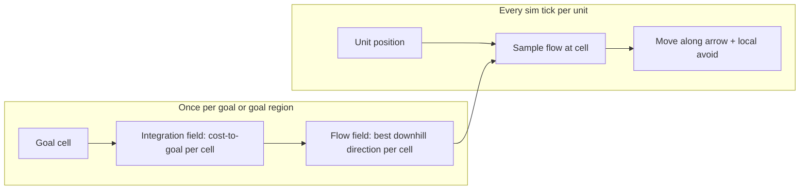

# Flow fields for mass unit movement (research)

**Status:** hybrid — squad move orders (≥ 6 units) use **flow fields** ([`flow-field.ts`](../../../packages/shared/src/map/flow-field.ts), [`flow-navigation.ts`](../../../packages/shared/src/units/flow-navigation.ts)); smaller groups and chase still use **per-unit A\*** ([`pathfind.ts`](../../../packages/shared/src/map/pathfind.ts)).

## Why RTS games care

When dozens or hundreds of units share one move order, running **A\* per unit** does not scale:

| Approach | Cost per move order | Best for |
|----------|---------------------|----------|
| A\* per unit (current) | O(units × path length) | Small squads, chase targets, v0 scale |
| **Flow field** | O(grid cells) once + O(1) per unit per tick | Armies, shared destination, lane battles |
| Hierarchical (portals / navmesh) | O(zones) + local path | Large maps, long distances |
| Local avoidance only (RVO, boids) | O(nearby pairs) | Deconfliction on top of global nav |

Many RTS titles combine **one cheap global field** with **local separation** (we already have [`separateUnits`](../../../packages/shared/src/units/collision.ts)).

## What a flow field is

Think of the map as a grid of arrows all pointing toward the goal:



1. **Integration field** — run Dijkstra/BFS from the goal on the walkability grid (same baked barriers + dynamic structures as today). Each cell stores distance or cost-to-goal.
2. **Flow field** — for each walkable cell, pick the neighbor with the **lowest** integration value; store a unit vector (8 directions or continuous angle).
3. **Movement** — each tick, unit looks up its cell’s arrow and steps that way (plus unit–unit separation).

**One field update** serves **all units** heading to the same goal (or same snapped goal cell). That is why Supreme Commander 2-style systems use flow fields for armies.

References (external):

- [Flow Fields for Movement in Games (momentum.ai)](https://www.momentum.ai/blog/flow-fields-for-movement-in-games) — integration + flow, obstacles
- [Coherent Unit Movement (GDC / classic AI blog notes)](https://www.gamedeveloper.com/programming/coherent-unit-movement) — group pathing context
- [Continuum Crowds (PDF)](https://gamma.cs.unc.edu/FOCA/continuumCrowds.pdf) — density-aware variant when lanes get crowded

## How this compares to RTSBrowser today

**Current pipeline:**

- Static barrier grid baked at load ([`nav-grid.ts`](../../../packages/shared/src/map/nav-grid.ts))
- Dynamic structure blocking in [`isNavCellWalkable`](../../../packages/shared/src/map/pathfind.ts)
- Per-unit A\* + waypoint list on the unit ([`navigation.ts`](../../../packages/shared/src/units/navigation.ts))
- Local slide/steer in [`moveUnitToward`](../../../packages/shared/src/units/collision.ts) + `separateUnits`

**Already aligned with flow-field design:**

- Fixed **180×135** grid (~24k cells) — rebuilding one integration field per tick is feasible at 10 Hz if goals are few
- **Three lanes** + HQ bowls — goals often cluster; one field per “attack move” click is natural
- **Deterministic sim** — integer costs + fixed neighbor order keep replays stable (required for future multiplayer)

**Gaps before switching:**

- Move orders use **spread destinations** ([`moveDestinationsForGroup`](../../../packages/shared/src/units/combat.ts)) — need either one field per cluster goal or a **single snapped goal** + local offset at end
- **Chase / attack** moves a **moving target** — field must be **invalidated** when goal cell changes (same as today’s `navGoalKey`)
- **Multiple player squads** with different goals → one field per goal id (cap e.g. 4–8 active fields)

## Recommended hybrid for this project

Do **not** replace A\* entirely. Use a **tiered** model:

| Tier | Use | Implementation sketch |
|------|-----|-------------------------|
| **Squad flow** | ≥ N units (e.g. 6+) same move order | One integration + flow field per command id; units sample field |
| **Per-unit A\*** | Small selection, chase, congested corners | Keep current `findWorldPath` |
| **Local** | All units | Keep `separateUnits` + optional light RVO later |

### Flow field build (prototype spec)

```
cost[cell] = 1 + wallProximityPenalty + structureBlock
integrate[goal] = Dijkstra from goal on 8-neighbor grid
flow[cell] = normalize toward neighbor with min integrate
```

- **Invalidate** when: goal cell changes, structure placed/destroyed in a dirty rectangle, barrier unchanged (static).
- **Storage:** `Map<goalKey, { integrate: Float32Array, flowX: Int8Array, flowY: Int8Array, tick }>` in sim state or ephemeral per tick.

### Per-tick unit step (flow mode)

```ts
const cell = worldToNavCell(unit.x, unit.y);
const dir = sampleFlow(commandId, cell);
move = dir * speed;
apply separation with other units only (skip wall steer — field already avoids walls);
```

## Performance rough estimate (our map)

- Grid: 24,300 cells
- Dijkstra with binary heap: ~24k log 24k ≈ 350k ops — **well under 1 ms** in JS at v0 unit counts
- 50 units sampling flow: trivial
- **Risk:** 8 simultaneous attack groups × full Dijkstra per tick — cap active fields or dirty-region rebuild

## Open decisions (if we implement)

- [ ] Threshold: flow for groups ≥ 6 vs always flow for move orders
- [ ] Single goal vs per-unit goal cells for spread formations
- [ ] Chase: flow toward predicted target position vs keep A\*
- [ ] Debug overlay: draw flow arrows in dev mode ([`features/rendering`](../../rendering/))
- [ ] Feature home: extend `packages/shared/src/map/` vs new `packages/shared/src/pathfinding/flow.ts`

## Suggested next step

1. ~~Add **`buildFlowField(state, goalGx, goalGy)`**~~ — done in [`flow-field.ts`](../../../packages/shared/src/map/flow-field.ts).
2. ~~Wire move command for squads ≥ 6~~ — done via `navUseFlow` in [`combat.ts`](../../../packages/shared/src/units/combat.ts).
3. ~~Deterministic integration checksum test~~ — [`flow-field.test.ts`](../../../packages/shared/src/map/flow-field.test.ts).
4. Dev overlay: draw flow arrows; compare large-army visuals vs A\* in skirmish.

---

**See also:** [layout-v0.md](../../map-terrain/data/layout-v0.md) (lane topology), [AGENTS.md](../../../AGENTS.md) suggested `pathfinding` feature.
