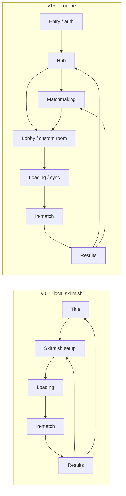
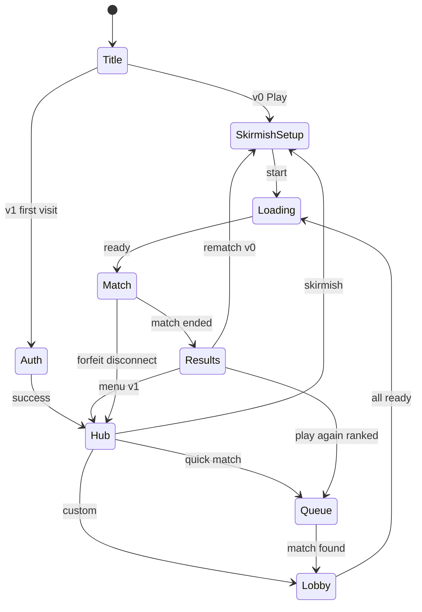

# Player journey — entry to rematch

**Status:** planning · **Audience:** designers and client implementers  
**Scope:** Full intended experience from first visit through match end. **v0** implements a shortened path (no login, no matchmaking); **v1 online** fills in auth and queue.

Design aligns with [vision.md](../../game-vision/data/vision.md) (geometric readability, browser play on PC and mobile), [factions.json](../../game-vision/data/factions.json) (Triad / Loop / Block), and the [mobile responsiveness plan](mobile-responsive-support.md).

---

## Design principles

| Principle | Implication |
|-----------|-------------|
| **Shape-first** | Faction pick and HUD use the same silhouette language as units ([visual-theme.md](../../rendering/data/visual-theme.md)). |
| **Short path to play (v0)** | One screen from title → skirmish setup → match. No account gate. |
| **Explicit state** | User always sees *where* they are: hub, queue, lobby, loading, in-match, results. |
| **Fail with recovery** | Auth, disconnect, and desync show a clear message + one primary action (retry, rejoin, exit). |
| **PC + mobile together** | New screens, HUD controls, and gameplay interactions must ship with desktop and touch support in the same feature slice. |

---

## Journey at a glance



| Phase | v0 | v1 online |
|-------|----|-----------|
| Identity | Skip (optional display name in skirmish only) | Guest JWT or OIDC login ([auth roadmap](../../multiplayer/data/research-networking-auth.md) §6) |
| Find a game | Skirmish setup only | Quick match queue **or** create/join room |
| Faction | Pick on setup screen | Pick in lobby; lock when ready |
| Play | Local sim + AI | Lockstep via server ([client-server-split](../../multiplayer/data/client-server-split.md)) |
| End | Local results | Results + optional rating stub |

---

## 1. Entry and identity

### 1.1 Title / attract (`screen.title`)

- **Purpose:** Brand moment; route to play.
- **Layout:** Logo/wordmark, subtle animated geometry (faction shapes drift, low contrast).
- **Primary actions:** **Play** (v0 → skirmish setup; v1 → hub if session exists else entry).
- **Secondary:** Settings (audio, graphics, keybindings stub), Credits (v1+).

### 1.2 Auth (`screen.auth`) — v1+, optional guest

Not in v0. Replaces the test harness “Account” panel with a product-quality flow.

| Mode | UX |
|------|-----|
| **Guest** | One tap “Play as guest” → API issues short-lived JWT + suggested display name (editable once). |
| **Register** | Email + password (min 8), confirm password; success → hub. |
| **Log in** | Email + password; “Forgot password” stub until IdP chosen. |

**States:**

- Idle → submitting (disable buttons, inline spinner) → success (route hub) or error (inline message, keep form).
- **Session restore:** If valid refresh token / cookie, skip auth → hub on load.

**Copy tone:** Neutral military-briefing (“Commander”, “Deploy”) — not grimdark.

**Errors (examples):**

| Code / case | Message pattern | Action |
|-------------|-----------------|--------|
| Invalid credentials | “Email or password incorrect.” | Retry |
| Email taken | “An account already exists for this email.” | Log in link |
| Network | “Could not reach the server.” | Retry |

---

## 2. Hub (`screen.hub`) — v1+

Central menu after identity is established (or skipped in v0).

| Control | Goes to | Notes |
|---------|---------|-------|
| **Quick match** | Matchmaking | Default ranked/casual mode TBD |
| **Skirmish vs AI** | Skirmish setup | Same setup UI as v0; can work offline in v0 |
| **Custom game** | Room browser or create room | Room ID / invite link |
| **Settings** | Settings overlay | Persist locally; sync settings later |
| **Log out** | Auth (v1) | Clears tokens |

**Header:** Display name, optional rank badge (v2).

---

## 3. Matchmaking (`screen.queue`) — v1+

**Entry:** Hub → Quick match.

| Element | Behavior |
|---------|----------|
| Status line | “Searching for opponent…” with animated dots |
| Mode chip | e.g. “1v1 · Casual” (fixed for first queue) |
| Timer | Elapsed wait (mm:ss) |
| **Cancel** | Returns to hub; leaves queue server-side |

**Match found:**

1. Short **found** state (~1–2 s): “Opponent found” + both display names (or “Anonymous” for guests).
2. Auto-advance to **lobby** with both players slotted (no faction yet or carry from prefs — see §4).

**Failure:**

- Queue timeout (e.g. 3 min): “No match found.” → **Try again** / **Back to hub**.
- Disconnect while queued: return to hub with banner “Connection lost.”

---

## 4. Skirmish setup & lobby

### 4.1 Skirmish setup (`screen.skirmish-setup`) — v0 primary

Single pre-match screen (replaces separate “lobby” for local play).

| Field | Control | Default |
|-------|---------|---------|
| Your faction | Three large cards (△ ○ □) | Last played or Triad |
| Opponent | AI | AI |
| AI faction | Same cards + **Random** | Random |
| Map | Dropdown (one map in v0) | `skirmish-alpha` |
| Difficulty | Easy / Normal / Hard | Normal |

**Faction card (each):**

- Primary shape icon at large size, faction color from [factions.json](../../game-vision/data/factions.json) `paletteHint`
- Display name + one-line tagline
- On select: border glow + checkmark; play identity strengths collapsed until hover (desktop)

**Validation:** Human faction required. **Start match** disabled until selected.

**Actions:**

- **Start match** → loading (§5)
- **Back** → title (v0) or hub (v1 skirmish path)

### 4.2 Multiplayer lobby (`screen.lobby`) — v1+

After matchmaking or custom join.

| Slot | Content |
|------|---------|
| Player 1..N | Avatar placeholder (shape), display name, faction pick, ready toggle |
| Empty slots | “Waiting…” or invite code |

**Faction rules (recommendation):**

- **1v1:** Both may pick any faction (mirror match allowed).
- **FFA (future):** Prefer unique factions; if duplicate, second picker gets “Taken” on that card.

**Ready flow:**

1. Each player selects faction + toggles **Ready**.
2. When all ready → host/server starts **countdown** (3…2…1) on lobby UI.
3. Transition to loading; no backing out without forfeiting (confirm dialog).

**Host tools (custom room):** Kick (host only), swap slot, AI backfill stub for skirmish-style testing.

---

## 5. Loading and match start (`screen.loading`)

Shared by v0 and online.

| Step | User sees | Behind the scenes |
|------|-----------|-------------------|
| Load assets | Progress bar + tip line | Pixi textures, audio |
| Initialize sim | “Preparing battlefield…” | Map seed, spawn points |
| Sync (online) | “Waiting for players…” | WS room joined, snapshot hash OK |
| Go | Brief fade | Sim tick 0, lockstep start |

**Tip lines:** Rotate faction trivia from `factions.json` taglines.

**Failure:**

- Asset error → “Failed to load game.” → Back to setup/lobby.
- Desync on start (online) → “Could not sync with server.” → Rejoin or hub.

**Match start moment:**

- Camera pans to player HQ spawn (1–2 s); optional “Mission: Destroy enemy HQ” if win condition is HQ ([prototype-v0.md](../../game-vision/data/prototype-v0.md) open).
- HUD fades in; simulation accepts input after pan completes (prevent mis-clicks).

---

## 6. In-match (`screen.match`)

Full-screen **game canvas** (Pixi) with **HUD chrome** overlaid (HTML or Pixi UI layer TBD).

### 6.1 HUD regions

```
┌─────────────────────────────────────────────────────────────┐
│ [Resources]              [Objectives mini]     [Menu ≡]     │
├─────────────────────────────────────────────────────────────┤
│                                                             │
│                      GAME VIEWPORT                          │
│                                                             │
├─────────────────────────────────────────────────────────────┤
│ [Minimap]  │ [Selection panel]  │ [Command card / build]     │
└─────────────────────────────────────────────────────────────┘
```

| Region | v0 content | Notes |
|--------|------------|-------|
| Resources | Single resource type + cap | Expand when economy feature adds second resource |
| Objectives | “Destroy enemy HQ” or elimination counter | Pinned from win condition |
| Menu | Pause (local), Surrender, Settings (audio only in v0) | Online: Surrender confirms forfeit |
| Minimap | Terrain + units + fog (if enabled) | Faction colors on blips |
| Selection | Portraits as shapes, HP bars, group count | Geometric silhouettes only |
| Command card | Move, attack, stop; structure build queue | Hotkeys QWER… per `input-selection` (future) |

### 6.2 Menu overlay (`overlay.pause`)

- **Resume**, **Restart** (skirmish only), **Quit to menu** (confirm).
- Online pause: **no global pause** in v1; only settings and surrender unless all players agree (defer).

### 6.3 Connection overlay (online)

If WebSocket drops:

- Banner: “Reconnecting…” with spinner.
- Success → resume; failure after N s → “Match ended” → results or hub with loss recorded (policy TBD).

### 6.4 Spectator / delay

Defer until v1.1; design slot: read-only camera, delayed stream label.

---

## 7. Win, lose, and results (`screen.results`)

Triggered when sim fires `matchEnded` with `winnerId` and `reason`.

### 7.1 Win conditions (align with game design)

| Condition | v0 | UI copy |
|-----------|----|---------|
| HQ destroyed | Preferred default | “Enemy HQ destroyed” / “Your HQ was destroyed” |
| Elimination | Alternative | “Enemy forces eliminated” |
| Surrender | Always | “Opponent surrendered” / “You surrendered” |
| Disconnect | Online | “Opponent disconnected” (win) / “You disconnected” (loss) |

### 7.2 Results layout

**Moment:** Gameplay input locked; camera may hold on wrecked HQ or fade to neutral tint.

| Block | Content |
|-------|---------|
| Headline | **VICTORY** / **DEFEAT** — large shape motif in winner’s faction geometry |
| Subhead | Win reason one line |
| Stats (v0 minimal) | Match time, units lost, units produced (stub zeros OK initially) |
| Online extras (v1) | Opponent name, optional +rating placeholder |

**Actions:**

| Button | v0 | v1 |
|--------|----|----|
| **Rematch** | Same setup, same settings | Request rematch if opponent in lobby; else queue |
| **Play again** | Skirmish setup | Hub |
| **Main menu** | Title | Hub |

**No dead-end:** Always at least two actions.

### 7.3 Emotional tone

- Victory: crisp, satisfying (short sting + shape burst) — not loot-box energy.
- Defeat: clear, respectful; highlight one “lesson” stat later (v2).

---

## 8. Settings (`overlay.settings`)

Accessible from title, hub, and in-match menu.

| Tab | v0 | v1+ |
|-----|----|-----|
| Audio | Master, SFX, music | Same |
| Video | Fullscreen, UI scale | Same |
| Controls | Keybinding list (read-only; [controls-v0.json](controls-v0.json) on settings screen) | Rebind |
| Account | Hidden | Email, log out, delete account stub |

---

## 9. Navigation state machine

Canonical screen IDs live in [screens.json](screens.json). Summary:



---

## 10. Implementation notes (client)

| Concern | Recommendation |
|---------|----------------|
| Routing | Single-page app; one “shell” router driven by `screens.json` transitions |
| Auth | Reuse `packages/client` API module; replace debug HTML in `main.ts` with screen components |
| Game vs chrome | Pixi owns world; DOM or `@pixi/ui` for HUD — decide in rendering feature |
| Persist last faction | `localStorage` key `rts.lastFaction` |
| Deep link | v1: `/join/:roomId` lands on auth then lobby |
| Responsive support | Follow [mobile-responsive-support.md](mobile-responsive-support.md); every feature summary should mention at least one desktop and one mobile verification check. |

---

## 11. Open decisions

- [ ] **Duplicate factions in 1v1** — allowed (mirror match) vs unique pick enforcement
- [ ] **Faction pick timing** — only in lobby vs allow pre-queue favorite in hub
- [ ] **Win condition default** — HQ destroy vs elimination for first map
- [ ] **Rematch online** — in-place lobby reset vs new queue
- [ ] **Ranked vs casual queue** — one queue for v1 or mode split
- [ ] **HQ destroy cinematic** — skip button vs forced 3 s pan
- [ ] **HUD tech** — DOM overlay vs Pixi UI for text-heavy panels
- [ ] **Guest → registered merge** — keep stats on upgrade ([auth research](../../multiplayer/data/research-networking-auth.md))

---

## 12. v0 delivery checklist

Ship these screens first to validate the loop without networking:

1. `screen.title`
2. `screen.skirmish-setup` (faction cards + start)
3. `screen.loading` (can be minimal spinner)
4. `screen.match` (HUD stub + Pixi viewport)
5. `screen.results`

Auth, hub, queue, and lobby come with v1 online test harness evolution.
